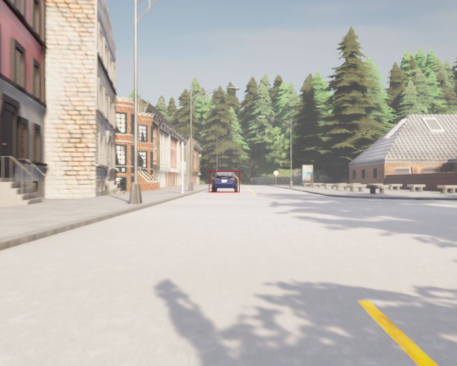
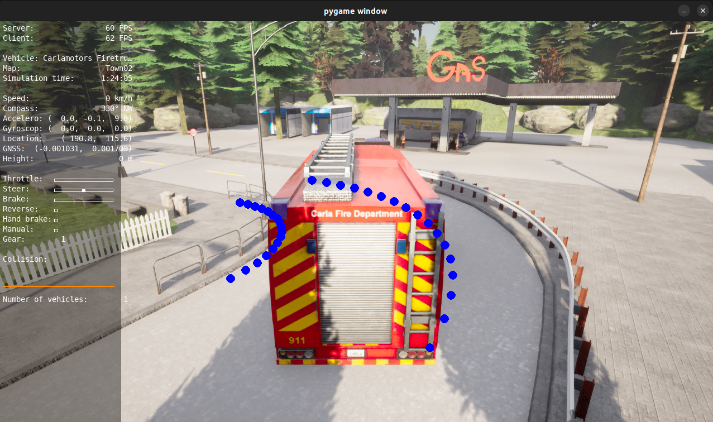

# General Information

This repository contains [Euro NCAP](https://www.euroncap.com/en/about-euro-ncap/) tests in [CARLA](https://carla.org//) simulator.

* `test_1` folder contains CCRs(Car-to-Car Rear stationary) test scenario in which an ego car accelerates and then brakes in front of a stationary car from 100 [m].

The folder contains a few utilities:

1. [Controller](./test_1/controller.py) - contains simple controller for the throttle/brake based on the current relative distance.
2. [Dynamics](./test_1/dynamics.py) - retrieve information about the state of the ego car.
3. [Scene](./test_1/scene.py) - functions to manage the simulation.
4. [Visualizer](./test_1/visualizer.py) - functions to plot ground-truth bounding box around the stationary car.
5. [Analysis](./test_1/analysis.py) - parse the `data.csv` file and plot a few insights from the simulation.



* `test_2` folder holds the modified [manual_control.py](https://github.com/carla-simulator/carla/blob/master/PythonAPI/examples/manual_control.py) version, integrated with lane detector, visualize the vehicle's current lanes boundaries. **(Currently contains a bug in the waypoint selection 28/02/2024)**



# Prerequisite

1. [CARLA docker image](https://carla.readthedocs.io/en/latest/build_docker/) - version: `0.9.15` 

                docker pull carlasim/carla:0.9.15


2. CARLA Python package, install with:

                pip install carla==0.9.15

3. docker compose.

# Install

1. Clone this repository:

                git clone git@github.com:iftahnaf/ccr_ncap.git            

*Note: make sure that you can run docker without sudo*


# Run

## Running with docker-compose
Using docker-compose, you will launch server(CARLA simulator) and client(Python API client) services for the simulation.
Running with:

        docker compose up

Changing the script is done via altering the command in the [docker-compose.yml](docker-compose.yml):

```yaml
      command: >
        /bin/bash -c "sleep 10 && python3 test_1/main.py"
```

## Running from terminal:
Open two terminals.

In the first terminal:
  
                docker run --privileged --gpus all --net=host -e DISPLAY=$DISPLAY carlasim/carla:0.9.15 /bin/bash ./CarlaUE4.sh -RenderOffScreen

In the second terminal:

                cd ccr_ncap/
                python3 ./test_1/main.py


